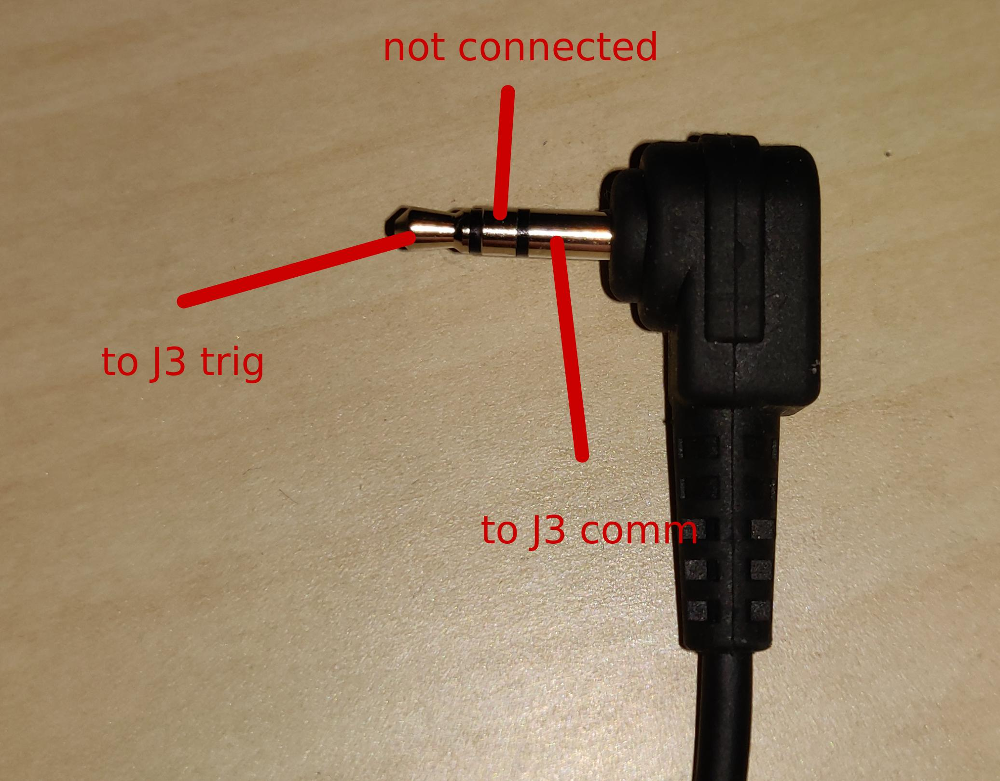

# autotrigger_DSLR
Device to automaticly take a number of long exposure pictures designed for astrophotography. 
Works with any DSLR that has a 2.5mm jack remote trigger connector and a bulb exposure mode. Here is a [Video](https://www.youtube.com/watch?v=2kZ-wBnaWUU "Video") with the device in Action

[](doc/img/autotrigger.jpg"autotrigger_DSLR")

## How to use
The device uses a 2.5mm headphoe jack to simulate an remote trigger. It is powered my USB. Uses SSD1306 OLED Display as Display. With 4 buttons you can change the exposure time and the number of Pictures to take. The controller is an ESP8266 (ESP-12F module), so wifi capabilities could be implemented (**but are not, yet**).

[](setup_overview.png"autotrigger_DSLR")

1. Plug the USB into any USB Power source (Powerbank/Phone Charger/...) to power the device. Power consumtion is only 50mA so any Power source should work. Make sure you have a Power source that doesn't switch off because not enough current is detected.
2. Plug the headphone jack into the external/remote trigger socket of the camera.
3. Turn on the camera and change the settings to bulb mode for long exposures, if you want short exposures (under 1s) adjust exposure time at the camera accordingly.
4. Change exposure time on the autotrigger with the UP and DOWN buttons. (1s - 300s, range can be changed in code)
5. Press NEXT to select number of Exposures.
6. Change number of exposures to how much exposures you want UP and DOWN buttons. (1 - 100, range can be changed in code)
7. Press START to start the configured Series of Exposures.
8. While one Session is runnig, some info is displayed (exposure number, time of current exposure, total time)
9. Wait until session is finished or press NEXT to abort an session (current exposue will be finished)

[](doc/img/session_screen.jpg"session_screen")

## Building

### Ordering PCB and Parts

Order the PCB from a manufacturer you like, i use [JLCPCB](https://jlcpcb.com/ "JLCPCB"), by uploading the [prepared gerber files](KiCAD/autotrigger_dslr_v1.zip).

#### Partslist:
| Part  | Value  | Package  | Comment  | Link  |
| ------------ | ------------ | ------------ | ------------ | ------------ |
| C1  | 10uF  | 0805  |   | https://www.lcsc.com/product-detail/Multilayer-Ceramic-Capacitors-MLCC-SMD-SMT_FH-Guangdong-Fenghua-Advanced-Tech-0805X106M160NT_C2832123.html  |
| C2  | 10uF  | 0805  |   | https://www.lcsc.com/product-detail/Multilayer-Ceramic-Capacitors-MLCC-SMD-SMT_FH-Guangdong-Fenghua-Advanced-Tech-0805X106M160NT_C2832123.html  |
| C3  | 100nF  | 0805  |   | https://www.lcsc.com/product-detail/Multilayer-Ceramic-Capacitors-MLCC-SMD-SMT_FH-BK-Guangdong-Fenghua-Bangke-Elec-0805B104J500NT_C2830722.html  |
| C4  | 10uF  | 0805  |   | https://www.lcsc.com/product-detail/Multilayer-Ceramic-Capacitors-MLCC-SMD-SMT_FH-Guangdong-Fenghua-Advanced-Tech-0805X106M160NT_C2832123.html  |
| C5  | 100nF  | 0805  |   | https://www.lcsc.com/product-detail/Multilayer-Ceramic-Capacitors-MLCC-SMD-SMT_FH-BK-Guangdong-Fenghua-Bangke-Elec-0805B104J500NT_C2830722.html  |
| D1  | 1N5819  | SOD-123  |   | https://www.lcsc.com/product-detail/Schottky-Barrier-Diodes-SBD_ZHIDE-1N5819W_C2683619.html  |
| D2  | 1N5819  | SOD-123   |   | https://www.lcsc.com/product-detail/Schottky-Barrier-Diodes-SBD_ZHIDE-1N5819W_C2683619.html  |
| F1  | 500mA  | 1812  | Polyfuse  | https://www.lcsc.com/product-detail/Resettable-Fuses_TECHFUSE-mSMD050-15V_C70110.html  |
| J1  |   | 5x2.54mm  | Pin Header Female  | https://www.lcsc.com/product-detail/Female-Headers_Ckmtw-Shenzhen-Cankemeng-B-2200S05P-A120_C124414.html  |
| J2  | SSD1306  | SSD1306  | Display, look for pinout *GND VCC SCL SDA* , 4Pin, White | https://www.aliexpress.com/item/32638662748.html |
| K1  | G6K  | G6K-2F  | Omron Relay  | https://www.lcsc.com/product-detail/Signal-Relays_Omron-Electronics-G6K-2F-Y-TR-DC5_C47190.html  |
| Q1  | MosFET  | SOT-23  | N-Channel  | https://www.lcsc.com/product-detail/MOSFETs_Sinopower-Semicon-SM2326NSANC-TRG_C368561.html  |
| R1  | 10k  | 0805  |   | https://www.lcsc.com/product-detail/Chip-Resistor-Surface-Mount_TyoHM-RMC080510K1-N_C269742.html  |
| R2  | 10k  | 0805  |   | https://www.lcsc.com/product-detail/Chip-Resistor-Surface-Mount_TyoHM-RMC080510K1-N_C269742.html  |
| R3  | 1k  | 0805  |   | https://www.lcsc.com/product-detail/Chip-Resistor-Surface-Mount_TyoHM-RMC08051K5-N_C269727.html  |
| R4  | 10k  | 0805  |   | https://www.lcsc.com/product-detail/Chip-Resistor-Surface-Mount_TyoHM-RMC080510K1-N_C269742.html  |
| R5  | 5k  | 0805  |   | https://www.lcsc.com/product-detail/Chip-Resistor-Surface-Mount_Viking-Tech-ARG05DTC5001_C2828783.html  |
| R6  | 5k  | 0805  |   | https://www.lcsc.com/product-detail/Chip-Resistor-Surface-Mount_Viking-Tech-ARG05DTC5001_C2828783.html  |
| R7  | 5k  | 0805  |   | https://www.lcsc.com/product-detail/Chip-Resistor-Surface-Mount_Viking-Tech-ARG05DTC5001_C2828783.html  |
| R8  | 5k  | 0805  |   | https://www.lcsc.com/product-detail/Chip-Resistor-Surface-Mount_Viking-Tech-ARG05DTC5001_C2828783.html  |
| R9  | 1k  | 0805  |   | https://www.lcsc.com/product-detail/Chip-Resistor-Surface-Mount_TyoHM-RMC08051K5-N_C269727.html  |
| R10  | 10k  | 0805  |   | https://www.lcsc.com/product-detail/Chip-Resistor-Surface-Mount_TyoHM-RMC080510K1-N_C269742.html  |
| R11  | 1k  | 0805  |   | https://www.lcsc.com/product-detail/Chip-Resistor-Surface-Mount_TyoHM-RMC08051K5-N_C269727.html  |
| SW1  | pushbutton  | SPST SMD  |   | https://www.lcsc.com/product-detail/Tactile-Switches_XKB-Connectivity-TS-1101-C-W_C318938.html  |
| SW2  | pushbutton  | SPST SMD  |   | https://www.lcsc.com/product-detail/Tactile-Switches_XKB-Connectivity-TS-1101-C-W_C318938.html  |
| SW3  | pushbutton  | THT 6x6x10mm  |   | https://www.lcsc.com/product-detail/Tactile-Switches_G-Switch-GT-TC096A-H100-L1_C963363.html  |
| SW4  | pushbutton  | THT 6mm_H9.5mm  |   | https://www.lcsc.com/product-detail/Tactile-Switches_G-Switch-GT-TC096A-H100-L1_C963363.html  |
| SW5  | pushbutton  | THT 6mm_H9.5mm  |   | https://www.lcsc.com/product-detail/Tactile-Switches_G-Switch-GT-TC096A-H100-L1_C963363.html  |
| SW6  | pushbutton  | THT 6mm_H9.5mm  |   | https://www.lcsc.com/product-detail/Tactile-Switches_G-Switch-GT-TC096A-H100-L1_C963363.html  |
| U1  | ESP8266  | ESP-12F  |   | https://www.lcsc.com/product-detail/WiFi-Modules_Ai-Thinker-ESP-12F-ESP8266MOD_C82891.html  |
| U2  | AMS1117-3.3  | SOT-223-3  |   | https://www.lcsc.com/product-detail/Linear-Voltage-Regulators-LDO_PUOLOP-AMS1117-3-3_C351784.html  |

#### You also need:
- 1x USB A cable (any can be used because it's solderd directly to the pcb)
- 1x 2.5mm headphone jack cable https://www.aliexpress.com/item/4001182848617.html
- 8x M2.5 5mm bolts https://www.aliexpress.com/item/32963722509.html
- cable ties for strain relief
- tape (electrical/kepton/... doesn't really matter)
- For programming: USB to serial Adapter and jumper cables

### 3D Printing
Print [case](FreeCAD/3dp/stl/case-case.stl) and [lid](FreeCAD/3dp/stl/case-led.stl) in PLA (recommended, but doesn't really matter) and standard settings.

### Soldering

1. Start soldering all SMD components, using the [schematic](doc/autotrigger_DSLR_v1_schematic.pdf) and the partslist above. Diode cathodes are indicated with "-".
2. Solder Programming Pin headers and THT pushbuttons.
3. Isolate the backside of the SSD1306 OLED Display with some tape, then solder in place.
4. Before soldering wires put them though holes in the case.
5. USB A cable: strip wire and check which is +5V (propably red) and GND (propably black) using a multimeter. Then solder to J4.
6. Headphone Jack cable: cut away female jack. Strip wire and tin the tips so that the isolating coating is burnt way (thats the way i do it). Then check which are the needed wires (multimeter continuity) and solder to J3, according to picture below.
[](doc/img/headphone_jack_connections.jpg"headphone_jack_connections")

### Assembly

1. Screw PCB to case using four M2.5 bolts.
2. Put a zip tie around both cables to wirk as strain relief.
3. Now upload software to the autotrigger, see *Configuration and Programming* section.
4. Screw lid to case using four M2.5 bolts.

## Configuration and Programming

1. autotrigger_DSLR is programmed in the [PlatformIO IDE](https://docs.platformio.org/en/latest/integration/ide/vscode.html#ide-vscode "PlatformIO IDE"). PlatformIO is needed to upload the Software to the autotrigger.
2. Open Project in PlatformIO
3. Open [src/main.cpp](src/main.cpp)
4. Change function options at the top of the document, if needed (more explosures, longer exposures, ...)
```cpp
//Function Options
#define minExposure 1000 //minimum exposure time in ms
#define maxExposure 300000 //maximum exposure time in ms
#define minNumberOfExposures 1
#define maxNumberOfExposures 100 //absolute max 255
#define waitingTimeBetweenExposures 2000 //time the controller waits for camera until it starts the next exposure
```
5. If buttons don't work properly, you may have to increase `buttonTolerance` or adjust button values
```cpp
//Button Values
#define valueButtonUp 588
#define valueButtonDown 328
#define valueButtonNext 231
#define valueButtonStart 181
#define buttonTolerance 10
```
6. Connect the autotrigger via USB to Serial Adapter. Only connect 5V **OR** 3.3V

| Serial Adapter  | autotrigger  |
| ------------ | ------------ |
| GND  | GND  |
| 5V  | 5  |
| **or** 3.3V  | **or** 3.3  |
| TX  | RX  |
| RX  | TX  |

7. Hit Upload, press both boot and reset button, release reset button, wait till upload has started, release boot button.
8. Wait until upload is finished.
9. press reset.
10. **ENJOY**

## Todo
- Mounting holes PCB need adjusdment, false measurement
